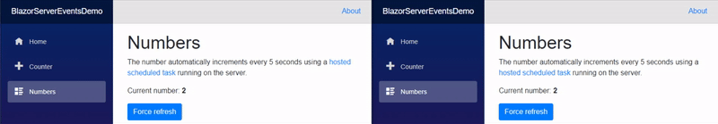
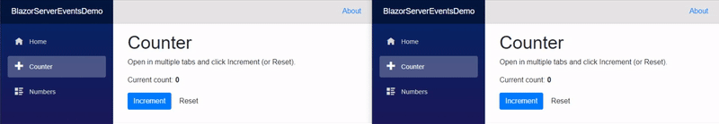

# Blazor Server Events Demo
A little demo that use .NET native events to trigger UI changes.
## Numbers
A number that automatically increments every 5 seconds using a [hosted scheduled task](https://docs.microsoft.com/en-us/aspnet/core/fundamentals/host/hosted-services) running on the server. 

## Counter
Shared value counter. Open in multiple tabs (or share with friends) to see the value update in real time everywhere.

